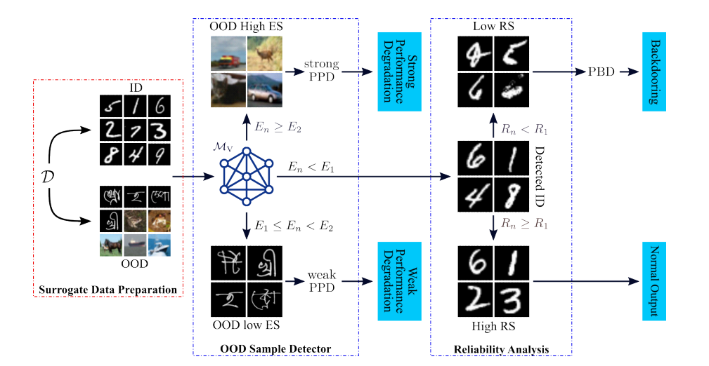
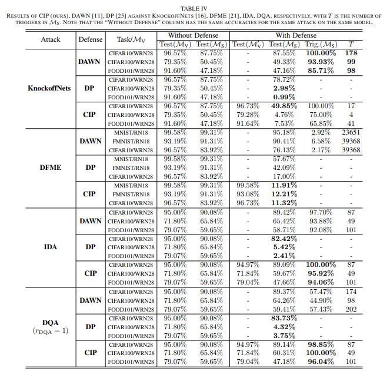

# Categorical Inference Poisoning: Verifiable Defense Against Black-Box DNN Model Stealing Without Constraining Surrogate Data and Query Times

## About 
we propose a two-step
categorical inference poisoning (CIP) framework, featuring both
poisoning for performance degradation (PPD) and poisoning for
backdooring (PBD). In the first poisoning step, incoming queries
are classified into ID and (out-of-distribution) OOD ones using an
energy score (ES) based OOD detector, and the latter are further
classified into high ES and low ES ones, which are subsequently
passed to a strong and a weak PPD process, respectively. In
the second poisoning step, difficult ID queries are detected by a
proposed reliability score (RS) measurement and are passed to a
PBD process. In doing so, the first step OOD poisoning leads to
substantial performance degradation, the second step ID poisoning
embeds backdoors in the surrogate models, and both processes
can well preserve model fidelity.




## Installation
Environments: This project uses python=3.8.3 and pytorch=1.10.0
```shell
pip install requirement.txt
```
## Quick start
### Training of victim model.
```shell
cd Victim_Model_Train
python main.py
```
The preparation and the structure of dataset:
```
Dataset
|----Cifar10
|  |----Cifar10_all
|  |  |----train
|  |  |  |----1.png
|  |  |  |----2.png
|  |  |  |----...
|  |  |----test
|  |----Cifar10_half
|  |  |----train
|  |  |  |----1.png
|  |  |  |----2.png
|  |  |  |----...
|  |  |----test
|----Cifar100
|...
|----FOOD101
```
The Cifar10_half is the half of Cifar10_all, and it's used to test the IDA and DQA (The number of each category in Cifar10_half is half that of Cifar10_all).
Note that it's necessary to set the form of attacks before testing:
```python
parser.add_argument('--attack',type=str,default='Datafree',choices=['Knockoff','Datafree','IDA'],help='choosing the attack forms')
```
and the final pt file will be saved in 
```
Trained
|----Datafree
|  |----without_fine-tuning.pt
|----Knockoff
|----IDA
```
### Boosting OOD detector with OE:
```shell
cd OOD_Detection
python Detection_train.py
```
Before the fine-tuning, the dataset of [tinyimage](https://archive.org/details/80-million-tiny-images-1-of-2) and the testing OOD datasets should be prepared:
```
Dataset
|----Open-set test
|  |----DTD
|  |  |----1.png
|  |  |...
|  |----Place365
|----tiny_images.bin
```
The path setting of tiny_images is in the 13th and 28th lines in the file
>CIP/Utils/tinyimages_80mn_loader.py

Note that the OOD datasets like DTD are used to test the performance of OOD detector and you could use any another type of OOD datasets even the noises.
The final pt file will be saved in 
```
Trained
|----Datafree
|  |----after_fine-tuning.pt
|----Knockoff
|----IDA
```
### Testing the performance of OOD detector and recording the threshold E1 and E2:
```shell
python Detection_test.py
```
A excel fie will be generated automatically which is used to record the energy threshold values.
|        |  dataset | FPR_energy | open-set_energy |
| :----:  | :----:  | :----: | :----: |
| 0  | Mnist | E1 | E2 |

### Testing the defense performance against KnockffNets:
```shell
cd Knockoff
python main.py
```
Data preparation of KnockffNets:
```
dataset
|----Imagenet_100K
|  |----1.png
|  |----2.png
|  |...
|  |----100000.png
```
To test the KnockoffNets, we need to collect 100K [ImageNets](https://www.image-net.org/) images.

And note in each attacks, we should determine whether poisoning and choose the poison methods.
```python
parser.add_argument('--poison', type=bool, default=True, help='whether poisoning')

parser.add_argument('--method', type=str, default='CIP',choices=['CIP','DP','DAWN'])
```
### Testing the defense performance against DFME:
```shell
cd DF
python main.py
```
Before testing we should set the path of pt file:   
```python
parser.add_argument('--pt_file',type=str,default='../Victim_Model_Train/Trained/Datafree/Mnist_resnet18_epoch_64_accuracy_99.61%.pt',help='setting the Victim model')
```
Note when testing the DP and DAWN, we should use the model without the fine-tuning of OE. In contrast, when testing the CIP, we should use the model after the fine-tuning of OE.

### IDA
```shell
cd IDA
python main.py
```
Data preparation of IDA:
```
dataset
|----Cifar10_half
|  |----1.png
|  |----2.png
|  |...
|  |----100000.png
|----Cifar100_half
|----FOOD101_half
```
The Cifar10_half in the folder of IDA is the images complementary to that in the folder of Victim_Model_Train.

### DQA
```shell
cd IDA
python main.py
```
Because the data sets used by DQA and IDA are exactly the same, there is no need to set the data set separately for DQA.
But the noise images should be prepared before testing:
```
DQA
|----Noise
|  |----N1.png
|  |----N2.png
|  |----N3.png
|  |...
|  |---N60000.png
```
### Main results
The experiment results of CIP, DAWN, DP against Knockoff, DFME, IDA, DQA:



